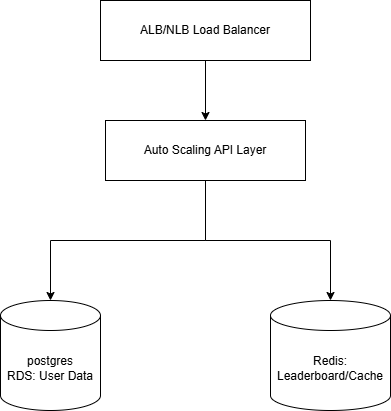

# User Leaderboard System

## Overview

A scalable leaderboard system for a gaming company, built with Node.js, TypeScript, PostgreSQL, and Redis.  
Supports efficient leaderboard queries, user rankings, and score updates for millions of users.

---

## Features

- Add new users with score and avatar
- Update user scores
- Retrieve top-N users (leaderboard)
- Retrieve user’s rank with neighbors
- High performance via Redis sorted set caching
- Ready for deployment with Docker & Kubernetes

---

## System Architecture

- **Load Balancer (ALB/NLB):** Entry point for all client/API requests, ensures high availability and routing.
- **Auto-Scaling API Layer:** Runs the Node.js/Express app (via EC2, ECS, or EKS).
- **Postgres RDS:** Stores persistent user data.
- **ElastiCache Redis:** Caches leaderboard data and supports fast rank/score queries.

---

## Getting Started

### Prerequisites

- [Docker](https://www.docker.com/)
- [docker-compose](https://docs.docker.com/compose/)
- (Optional) [Node.js](https://nodejs.org/) if running locally without Docker

### Environment Variables
Create a `.env` file in the root like .env-example file.

## Start with Docker Compose
`docker-compose up --build`

This starts:

* Node.js API server (localhost:4000)
* PostgreSQL database
* Redis cache
  

## Database Schema
| Column      | Type      | Description         |
| ----------- | --------- | ------------------- |
| id          | bigint    | Primary key         |
| username    | varchar   | User display name   |
| avatar\_url | varchar   | Optional avatar img |
| score       | bigint    | User’s score        |
| created\_at | timestamp | Creation time       |

**Indexes**: Composite index on (score DESC, id ASC) for efficient leaderboard queries.

## Architecture & Scalability Notes

* Leaderboard & ranking queries use Redis sorted sets for O(log N) inserts/updates and O(1) rank/score lookups.

* Persistent storage is PostgreSQL, with regular sync/refresh to Redis.

* Auto-scaling API layer and managed databases for handling large scale.

# run Test regression
`yarn test`